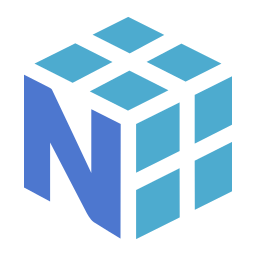
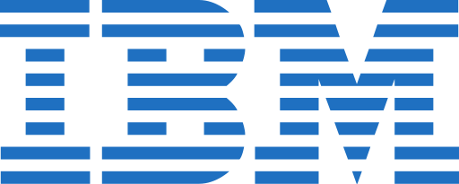

  
  
  
  

## Hi there 👋

I'm Alan, I'm from Mexico, I live in the city of Guadalajara.

I'm a python developer with experience doing data analysis, graphing and experiments.
I also really enjoy automation, making scripts to make things easier and organized.

I really enjoy learning new things and being able to apply new knowledge.

Although I am something new in this, I have a great capacity to acquire new things and my impulse to know the reason for things leads me to acquire good foundations to be able to extrapolate my knowledge to other contexts
___
##  Some Technologies and frameworks

  

  
  

  
  
  

  
  
  
  

##  Enviroment and tools

  
  

  
  
  

___
 
<!--  -->

<!-- 

 Funny statistics 
 -->

### 📊 Funny statistics

  

  

  

``

<!-- 
 -->

 

___

 

<!-- 

 My favorite repositories 
 -->

### 🌟 My favorite repositories

  

  

  

  

<!-- 
 -->

<!--
**AlanVazquez99/AlanVazquez99** is a ✨ _special_ ✨ repository because its `README.md` (this file) appears on your GitHub profile.

Here are some ideas to get you started:

- 🔭 I’m currently working on ...
- 🌱 I’m currently learning ...
- 👯 I’m looking to collaborate on ...
- 🤔 I’m looking for help with ...
- 💬 Ask me about ...
- 📫 How to reach me: ...
- 😄 Pronouns: ...
- ⚡ Fun fact: ...
-->
